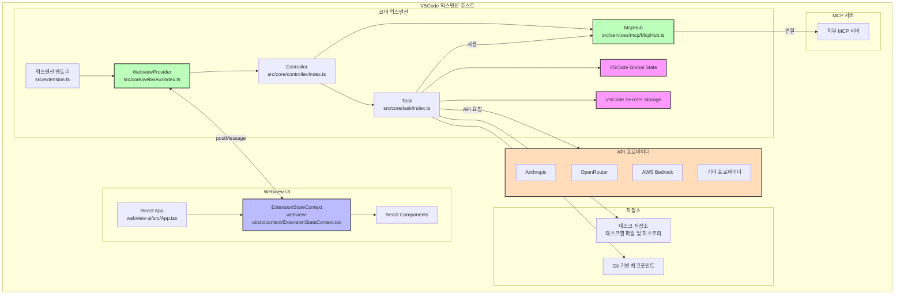

# Cline 익스텐션 아키텍처 및 개발 가이드

## 프로젝트 개요

Cline은 코어 익스텐션 백엔드와 React 기반의 웹뷰 프론트엔드가 결합된 AI 지원 VSCode 익스텐션입니다. 이 익스텐션은 TypeScript로 구축되었으며 모듈식 아키텍처 패턴을 따릅니다.

## 아키텍처 개요



## 정의 

- **코어 익스텐션(Core Extension)**: `src` 폴더 내의 모든 것으로, 모듈식 컴포넌트로 구성됩니다.
- **코어 익스텐션 상태(Core Extension State)**: `src/core/controller/index.ts`의 `Controller` 클래스에 의해 관리되며, 익스텐션 상태의 유일한 원천(Single Source of Truth) 역할을 합니다. 여러 유형의 영구 저장소(글로벌 상태, 워크스페이스 상태, 시크릿)를 관리하고, 코어 익스텐션과 웹뷰 컴포넌트 모두에 상태를 배포하며, 여러 익스텐션 인스턴스 간의 상태를 조정합니다. 여기에는 API 구성, 태스크 히스토리, 설정 및 MCP 구성 관리가 포함됩니다.
- **웹뷰(Webview)**: `webview-ui` 내의 모든 것으로, 사용자가 보는 모든 React 또는 뷰와 사용자 상호작용 컴포넌트를 포함합니다.
- **웹뷰 상태(Webview State)**: `webview-ui/src/context/ExtensionStateContext.tsx`의 `ExtensionStateContext`에 의해 관리되며, 컨텍스트 프로바이더 패턴을 통해 React 컴포넌트에 익스텐션 상태에 대한 접근 권한을 제공합니다. UI 컴포넌트의 로컬 상태를 유지하고, 메시지 이벤트를 통한 실시간 업데이트를 처리하며, 부분 메시지 업데이트를 관리하고, 상태 수정을 위한 메서드를 제공합니다. 이 컨텍스트에는 익스텐션 버전, 메시지, 태스크 히스토리, 테마, API 구성, MCP 서버, 마켓플레이스 카탈로그 및 워크스페이스 파일 경로가 포함됩니다. VSCode의 메시지 전달 시스템을 통해 코어 익스텐션과 동기화되며 커스텀 훅(`useExtensionState`)을 통해 상태에 대한 타입 안정성 있는 접근을 제공합니다.

### 코어 익스텐션 아키텍처

코어 익스텐션은 명확한 계층 구조를 따릅니다:

1. **WebviewProvider** (src/core/webview/index.ts): 웹뷰 수명 주기 및 통신 관리
2. **Controller** (src/core/controller/index.ts): 웹뷰 메시지 및 태스크 관리 처리
3. **Task** (src/core/task/index.ts): API 요청 및 도구(tool) 작업 실행

이 아키텍처는 명확한 관심사 분리를 제공합니다:
- WebviewProvider는 VSCode 웹뷰 통합에 집중합니다.
- Controller는 상태를 관리하고 태스크를 조정합니다.
- Task는 AI 요청 및 도구 작업의 실행을 담당합니다.

### WebviewProvider 구현

`src/core/webview/index.ts`의 `WebviewProvider` 클래스는 다음을 담당합니다:

- 정적 세트(`activeInstances`)를 통한 다중 활성 인스턴스 관리
- 웹뷰 수명 주기 이벤트 처리(생성, 가시성 변경, 폐기)
- 적절한 CSP 헤더가 포함된 HTML 콘텐츠 생성 구현
- 개발을 위한 HMR(Hot Module Replacement) 지원
- 웹뷰와 익스텐션 간의 메시지 리스너 설정

WebviewProvider는 Controller에 대한 참조를 유지하고 메시지 처리를 위임합니다. 또한 사이드바와 탭 패널 웹뷰 모두를 생성하여 Cline이 VSCode 내의 다양한 컨텍스트에서 사용될 수 있도록 합니다.

### 코어 익스텐션 상태

`Controller` 클래스는 여러 유형의 영구 저장소를 관리합니다:

- **글로벌 상태(Global State):** 모든 VSCode 인스턴스에 걸쳐 저장됩니다. 전역적으로 유지되어야 하는 설정 및 데이터에 사용됩니다.
- **워크스페이스 상태(Workspace State):** 현재 워크스페이스에 국한됩니다. 태스크별 데이터 및 설정에 사용됩니다.
- **시크릿(Secrets):** API 키와 같은 민감한 정보를 위한 안전한 저장소입니다.

`Controller`는 코어 익스텐션과 웹뷰 컴포넌트 모두에 상태 배포를 처리합니다. 또한 여러 익스텐션 인스턴스 간의 상태를 조정하여 일관성을 보장합니다.

인스턴스 간 상태 동기화는 다음을 통해 처리됩니다:
- 태스크 히스토리 및 대화 데이터를 위한 파일 기반 저장소
- 설정 및 구성을 위한 VSCode 글로벌 상태 API
- 민감한 정보를 위한 시크릿 저장소
- 파일 변경 및 구성 업데이트를 위한 이벤트 리스너

Controller는 다음을 위한 메서드를 구현합니다:
- 태스크 상태 저장 및 로드
- API 구성 관리
- 사용자 인증 처리
- MCP 서버 연결 조정
- 태스크 히스토리 및 체크포인트 관리

### 웹뷰 상태

`webview-ui/src/context/ExtensionStateContext.tsx`의 `ExtensionStateContext`는 React 컴포넌트에 익스텐션 상태에 대한 접근 권한을 제공합니다. 컨텍스트 프로바이더 패턴을 사용하고 UI 컴포넌트를 위한 로컬 상태를 유지합니다. 컨텍스트 구성 요소:

- 익스텐션 버전
- 메시지
- 태스크 히스토리
- 테마
- API 구성
- MCP 서버
- 마켓플레이스 카탈로그
- 워크스페이스 파일 경로

VSCode의 메시지 전달 시스템을 통해 코어 익스텐션과 동기화되며 커스텀 훅(`useExtensionState`)을 통해 상태에 대한 타입 안정성 있는 접근을 제공합니다.

ExtensionStateContext 처리 사항:
- 메시지 이벤트를 통한 실시간 업데이트
- 스트리밍 콘텐츠를 위한 부분 메시지 업데이트
- 세터(setter) 메서드를 통한 상태 수정
- 커스텀 훅을 통한 상태에 대한 타입 안정성 있는 접근

## API 프로바이더 시스템

Cline은 모듈식 API 프로바이더 시스템을 통해 여러 AI 프로바이더를 지원합니다. 각 프로바이더는 `src/api/providers/` 디렉토리에 개별 모듈로 구현되며 공통 인터페이스를 따릅니다.

### API 프로바이더 아키텍처

API 시스템의 구성 요소:

1. **API 핸들러(API Handlers)**: `src/api/providers/`에 있는 프로바이더별 구현체
2. **API 트랜스포머(API Transformers)**: `src/api/transform/`에 있는 스트림 변환 유틸리티
3. **API 구성(API Configuration)**: API 키 및 엔드포인트에 대한 사용자 설정
4. **API 팩토리(API Factory)**: 적절한 핸들러를 생성하는 빌더 함수

주요 프로바이더:
- **Anthropic**: Claude 모델과 직접 통합
- **OpenRouter**: 여러 모델 프로바이더를 지원하는 메타 프로바이더
- **AWS Bedrock**: 아마존 AI 서비스와의 통합
- **Gemini**: 구글 AI 모델
- **Cerebras**: Llama, Qwen, DeepSeek 모델을 사용한 고성능 추론
- **Ollama**: 로컬 모델 호스팅
- **LM Studio**: 로컬 모델 호스팅
- **VSCode LM**: VSCode 내장 언어 모델

### API 구성 관리

API 구성은 안전하게 저장됩니다:
- API 키는 VSCode 시크릿 저장소에 저장됩니다.
- 모델 선택 및 비민감 설정은 글로벌 상태에 저장됩니다.
- Controller는 프로바이더 간 전환 및 구성 업데이트를 관리합니다.

시스템 지원 사항:
- API 키의 안전한 저장
- 모델 선택 및 구성
- 자동 재시도 및 에러 처리
- 토큰 사용량 추적 및 비용 계산
- 컨텍스트 윈도우 관리

### Plan/Act 모드 API 구성

Cline은 Plan 및 Act 모드에 대해 별도의 모델 구성을 지원합니다:
- 계획(planning)과 실행(execution)에 서로 다른 모델을 사용할 수 있습니다.
- 모드 전환 시 모델 선택 상태가 유지됩니다.
- Controller는 모드 간 전환을 처리하고 그에 따라 API 구성을 업데이트합니다.

## 태스크 실행 시스템

Task 클래스는 AI 요청 및 도구 작업을 실행하는 역할을 합니다. 각 태스크는 개별 Task 클래스 인스턴스에서 실행되어 격리 및 적절한 상태 관리를 보장합니다.

### 태스크 실행 루프

핵심 태스크 실행 루프 패턴:

```typescript
class Task {
  async initiateTaskLoop(userContent: UserContent, isNewTask: boolean) {
    while (!this.abort) {
      // 1. API 요청 수행 및 응답 스트리밍
      const stream = this.attemptApiRequest()
      
      // 2. 콘텐츠 블록 파싱 및 제시
      for await (const chunk of stream) {
        switch (chunk.type) {
          case "text":
            // 콘텐츠 블록으로 파싱
            this.assistantMessageContent = parseAssistantMessageV2(chunk.text)
            // 사용자에게 블록 제시
            await this.presentAssistantMessage()
            break
        }
      }
      
      // 3. 도구 실행이 완료될 때까지 대기
      await pWaitFor(() => this.userMessageContentReady)
      
      // 4. 도구 결과와 함께 루프 계속
      const recDidEndLoop = await this.recursivelyMakeClineRequests(
        this.userMessageContent
      )
    }
  }
}
```

### 메시지 스트리밍 시스템

스트리밍 시스템은 실시간 업데이트 및 부분 콘텐츠를 처리합니다:

```typescript
class Task {
  async presentAssistantMessage() {
    // 레이스 컨디션 방지를 위한 스트리밍 락 처리
    if (this.presentAssistantMessageLocked) {
      this.presentAssistantMessageHasPendingUpdates = true
      return
    }
    this.presentAssistantMessageLocked = true

    // 현재 콘텐츠 블록 제시
    const block = this.assistantMessageContent[this.currentStreamingContentIndex]
    
    // 다양한 유형의 콘텐츠 처리
    switch (block.type) {
      case "text":
        await this.say("text", content, undefined, block.partial)
        break
      case "tool_use":
        // 도구 실행 처리
        break
    }

    // 완료 시 다음 블록으로 이동
    if (!block.partial) {
      this.currentStreamingContentIndex++
    }
  }
}
```

### 도구 실행 흐름

도구는 엄격한 실행 패턴을 따릅니다:

```typescript
class Task {
  async executeToolWithApproval(block: ToolBlock) {
    // 1. 자동 승인 설정 확인
    if (this.shouldAutoApproveTool(block.name)) {
      await this.say("tool", message)
      this.consecutiveAutoApprovedRequestsCount++
    } else {
      // 2. 사용자 승인 요청
      const didApprove = await askApproval("tool", message)
      if (!didApprove) {
        this.didRejectTool = true
        return
      }
    }

    // 3. 도구 실행
    const result = await this.executeTool(block)

    // 4. 체크포인트 저장
    await this.saveCheckpoint()

    // 5. API로 결과 반환
    return result
  }
}
```

### 에러 처리 및 복구

시스템에는 견고한 에러 처리가 포함되어 있습니다:

```typescript
class Task {
  async handleError(action: string, error: Error) {
    // 1. 태스크가 포기되었는지 확인
    if (this.abandoned) return
    
    // 2. 에러 메시지 포맷팅
    const errorString = `Error ${action}: ${error.message}`
    
    // 3. 사용자에게 에러 제시
    await this.say("error", errorString)
    
    // 4. 도구 결과에 에러 추가
    pushToolResult(formatResponse.toolError(errorString))
    
    // 5. 리소스 정리
    await this.diffViewProvider.revertChanges()
    await this.browserSession.closeBrowser()
  }
}
```

### API 요청 및 토큰 관리

Task 클래스는 재시도, 스트리밍, 토큰 관리 기능이 내장된 API 요청을 처리합니다:

```typescript
class Task {
  async *attemptApiRequest(previousApiReqIndex: number): ApiStream {
    // 1. MCP 서버 연결 대기
    await pWaitFor(() => this.controllerRef.deref()?.mcpHub?.isConnecting !== true)

    // 2. 컨텍스트 윈도우 관리
    const previousRequest = this.clineMessages[previousApiReqIndex]
    if (previousRequest?.text) {
      const { tokensIn, tokensOut } = JSON.parse(previousRequest.text || "{}")
      const totalTokens = (tokensIn || 0) + (tokensOut || 0)
      
      // 컨텍스트 제한에 도달하면 대화 절단(truncate)
      if (totalTokens >= maxAllowedSize) {
        this.conversationHistoryDeletedRange = this.contextManager.getNextTruncationRange(
          this.apiConversationHistory,
          this.conversationHistoryDeletedRange,
          totalTokens / 2 > maxAllowedSize ? "quarter" : "half"
        )
      }
    }

    // 3. 자동 재시도를 포함한 스트리밍 처리
    try {
      this.isWaitingForFirstChunk = true
      const firstChunk = await iterator.next()
      yield firstChunk.value
      this.isWaitingForFirstChunk = false
      
      // 남은 청크 스트리밍
      yield* iterator
    } catch (error) {
      // 4. 재시도를 포함한 에러 처리
      if (isOpenRouter && !this.didAutomaticallyRetryFailedApiRequest) {
        await setTimeoutPromise(1000)
        this.didAutomaticallyRetryFailedApiRequest = true
        yield* this.attemptApiRequest(previousApiReqIndex)
        return
      }
      
      // 5. 자동 재시도 실패 시 사용자에게 재시도 확인
      const { response } = await this.ask(
        "api_req_failed",
        this.formatErrorWithStatusCode(error)
      )
      if (response === "yesButtonClicked") {
        await this.say("api_req_retried")
        yield* this.attemptApiRequest(previousApiReqIndex)
        return
      }
    }
  }
}
```

주요 특징:

1. **컨텍스트 윈도우 관리**
   - 요청 간 토큰 사용량 추적
   - 필요 시 대화 자동 절단
   - 공간 확보 중에도 중요 맥락 보존
   - 모델별 컨텍스트 크기 처리

2. **스트리밍 아키텍처**
   - 실시간 청크 처리
   - 부분 콘텐츠 처리
   - 레이스 컨디션 방지
   - 스트리밍 중 에러 복구

3. **에러 처리**
   - 일시적 장애에 대한 자동 재시도
   - 지속적 문제에 대한 사용자 주도 재시도
   - 상세 에러 보고
   - 실패 시 상태 정리

4. **토큰 추적**
   - 요청별 토큰 계산
   - 누적 사용량 추적
   - 비용 계산
   - 캐시 히트 모니터링

### 컨텍스트 관리 시스템

컨텍스트 관리 시스템은 컨텍스트 윈도우 오버플로 에러를 방지하기 위해 대화 히스토리 절단을 처리합니다. `ContextManager` 클래스에 구현되어 있으며, 긴 대화가 모델 컨텍스트 제한 내에 머물도록 하면서 핵심 맥락은 보존합니다.

주요 특징:

1. **모델 인식 크기 조정**: 모델별 컨텍스트 윈도우(DeepSeek 64K, 대부분의 모델 128K, Claude 200K)에 따라 동적으로 조정합니다.

2. **사전 대응적 절단**: 토큰 사용량을 모니터링하고 제한에 근접할 때 미리 대화를 절단하며 모델에 따라 27K-40K 토큰의 버퍼를 유지합니다.

3. **지능적 보존**: 절단 시 항상 원래의 태스크 메시지를 보존하고 사용자-어시스턴트 대화 구조를 유지합니다.

4. **적응형 전략**: 컨텍스트 압박에 따라 대화의 절반 또는 3/4을 제거하는 등 서로 다른 절단 전략을 사용합니다.

5. **에러 복구**: 여러 프로바이더의 컨텍스트 윈도우 에러에 대한 특수 탐지를 포함하며, 필요 시 자동 재시도 및 더 공격적인 절단을 수행합니다.

### 태스크 상태 및 재개

Task 클래스는 견고한 태스크 상태 관리 및 재개 기능을 제공합니다:

```typescript
class Task {
  async resumeTaskFromHistory() {
    // 1. 저장된 상태 로드
    this.clineMessages = await getSavedClineMessages(this.getContext(), this.taskId)
    this.apiConversationHistory = await getSavedApiConversationHistory(this.getContext(), this.taskId)

    // 2. 중단된 도구 실행 처리
    const lastMessage = this.apiConversationHistory[this.apiConversationHistory.length - 1]
    if (lastMessage.role === "assistant") {
      const toolUseBlocks = content.filter(block => block.type === "tool_use")
      if (toolUseBlocks.length > 0) {
        // 중단된 도구 응답 추가
        const toolResponses = toolUseBlocks.map(block => ({
          type: "tool_result",
          tool_use_id: block.id,
          content: "도구 호출이 완료되기 전에 태스크가 중단되었습니다."
        }))
        modifiedOldUserContent = [...toolResponses]
      }
    }

    // 3. 중단 알림
    const agoText = this.getTimeAgoText(lastMessage?.ts)
    newUserContent.push({
      type: "text",
      text: `[태스크 재개] 이 태스크는 ${agoText}에 중단되었습니다. 작업이 완료되었을 수도 있고 아닐 수도 있으니 태스크 맥락을 다시 확인해 주세요.`
    })

    // 4. 태스크 실행 재개
    await this.initiateTaskLoop(newUserContent, false)
  }

  private async saveTaskState() {
    // 대화 히스토리 저장
    await saveApiConversationHistory(this.getContext(), this.taskId, this.apiConversationHistory)
    await saveClineMessages(this.getContext(), this.taskId, this.clineMessages)
    
    // 체크포인트 생성
    const commitHash = await this.checkpointTracker?.commit()
    
    // 태스크 히스토리 업데이트
    await this.controllerRef.deref()?.updateTaskHistory({
      id: this.taskId,
      ts: lastMessage.ts,
      task: taskMessage.text,
      // ... 기타 메타데이터
    })
  }
}
```

태스크 상태 관리의 주요 측면:

1. **태스크 영속성**
   - 각 태스크는 고유 ID와 전용 저장소 디렉토리를 가집니다.
   - 대화 히스토리는 각 메시지 이후에 저장됩니다.
   - 파일 변경 사항은 Git 기반 체크포인트를 통해 추적됩니다.
   - 터미널 출력 및 브라우저 상태가 보존됩니다.

2. **상태 복구**
   - 태스크는 어느 지점에서든 재개될 수 있습니다.
   - 중단된 도구 실행은 우아하게 처리됩니다.
   - 파일 변경 사항은 체크포인트에서 복구될 수 있습니다.
   - 컨텍스트는 VSCode 세션 간에 보존됩니다.

3. **워크스페이스 동기화**
   - 파일 변경 사항은 Git을 통해 추적됩니다.
   - 도구 실행 후에 체크포인트가 생성됩니다.
   - 어느 체크포인트로든 상태를 복구할 수 있습니다.
   - 체크포인트 간에 변경 사항을 비교할 수 있습니다.

4. **에러 복구**
   - 실패한 API 요청을 재시도할 수 있습니다.
   - 중단된 도구 실행이 표시됩니다.
   - 리소스가 적절히 정리됩니다.
   - 사용자에게 상태 변경이 통보됩니다.

## Plan/Act 모드 시스템

Cline은 계획(planning)과 실행(execution)을 분리하는 이중 모드 시스템을 구현합니다:

### 모드 아키텍처

Plan/Act 모드 시스템 구성 요소:

1. **모드 상태**: Controller 상태의 `chatSettings.mode`에 저장됩니다.
2. **모드 전환**: Controller의 `togglePlanActModeWithChatSettings`에 의해 처리됩니다.
3. **모드별 모델**: 각 모드에 서로 다른 모델을 사용하기 위한 선택적 구성입니다.
4. **모드별 프롬프팅**: 계획과 실행에 서로 다른 시스템 프롬프트를 사용합니다.

### 모드 전환 프로세스

모드 간 전환 시:

1. 현재 모델 구성이 모드별 상태로 저장됩니다.
2. 이전 모드의 모델 구성이 복구됩니다.
3. Task 인스턴스가 새로운 모드로 업데이트됩니다.
4. 웹뷰에 모드 변경이 통보됩니다.
5. 분석을 위한 텔레메트리 이벤트가 캡처됩니다.

### Plan 모드

Plan 모드 설계 목적:
- 정보 수집 및 맥락 구축
- 확인 질문 던지기
- 상세 실행 계획 수립
- 사용자와 접근 방식 논의

Plan 모드에서 AI는 `plan_mode_respond` 도구를 사용하여 동작을 실행하지 않고 대화식 계획 수립에 참여합니다.

### Act 모드

Act 모드 설계 목적:
- 계획된 동작 실행
- 도구를 사용하여 파일 수정, 명령 실행 등 수행
- 솔루션 구현
- 결과 및 완료 피드백 제공

Act 모드에서 AI는 `plan_mode_respond`를 제외한 모든 도구에 접근할 수 있으며 논의보다는 구현에 집중합니다.

## 데이터 흐름 및 상태 관리

### 코어 익스텐션의 역할

Controller는 모든 영구 상태의 유일한 원천 역할을 합니다. 기능:
- VSCode 글로벌 상태 및 시크릿 저장소 관리
- 컴포넌트 간 상태 업데이트 조정
- 웹뷰 새로고침 시 상태 일관성 보장
- 태스크별 상태 영속성 처리
- 체크포인트 생성 및 복구 관리

### 터미널 관리

Task 클래스는 터미널 인스턴스 및 명령 실행을 관리합니다:

```typescript
class Task {
  async executeCommandTool(command: string): Promise<[boolean, ToolResponse]> {
    // 1. 터미널 획득 또는 생성
    const terminalInfo = await this.terminalManager.getOrCreateTerminal(cwd)
    terminalInfo.terminal.show()

    // 2. 출력 스트리밍과 함께 명령 실행
    const process = this.terminalManager.runCommand(terminalInfo, command)
    
    // 3. 실시간 출력 처리
    let result = ""
    process.on("line", (line) => {
      result += line + "\n"
      if (!didContinue) {
        sendCommandOutput(line)
      } else {
        this.say("command_output", line)
      }
    })

    // 4. 완료 또는 사용자 피드백 대기
    let completed = false
    process.once("completed", () => {
      completed = true
    })

    await process

    // 5. 결과 반환
    if (completed) {
      return [false, `명령이 실행되었습니다.\n${result}`]
    } else {
      return [
        false,
        `명령이 여전히 사용자의 터미널에서 실행 중입니다.\n${result}\n\n향후 터미널 상태와 새로운 출력에 대해 업데이트될 것입니다.`
      ]
    }
  }
}
```

주요 특징:
1. **터미널 인스턴스 관리**
   - 다중 터미널 지원
   - 터미널 상태 추적(사용 중/미사용)
   - 프로세스 쿨다운 모니터링
   - 터미널별 출력 히스토리

2. **명령 실행**
   - 실시간 출력 스트리밍
   - 사용자 피드백 처리
   - 프로세스 상태 모니터링
   - 에러 복구

### 브라우저 세션 관리

Task 클래스는 Puppeteer를 통해 브라우저 자동화를 처리합니다:

```typescript
class Task {
  async executeBrowserAction(action: BrowserAction): Promise<BrowserActionResult> {
    switch (action) {
      case "launch":
        // 1. 고정 해상도로 브라우저 실행
        await this.browserSession.launchBrowser()
        return await this.browserSession.navigateToUrl(url)

      case "click":
        // 2. 좌표를 통한 클릭 동작 처리
        return await this.browserSession.click(coordinate)

      case "type":
        // 3. 키보드 입력 처리
        return await this.browserSession.type(text)

      case "close":
        // 4. 리소스 정리
        return await this.browserSession.closeBrowser()
    }
  }
}
```

주요 측면:
1. **브라우저 제어**
   - 900x600 고정 해상도 창
   - 태스크 수명 주기당 단일 인스턴스
   - 태스크 완료 시 자동 정리
   - 콘솔 로그 캡처

2. **상호작용 처리**
   - 좌표 기반 클릭
   - 키보드 입력 시뮬레이션
   - 스크린샷 캡처
   - 에러 복구

## MCP (Model Context Protocol) 통합

### MCP 아키텍처

MCP 시스템 구성 요소:

1. **McpHub 클래스**: `src/services/mcp/McpHub.ts`에 있는 중앙 관리자
2. **MCP 연결**: 외부 MCP 서버에 대한 연결 관리
3. **MCP 설정**: JSON 파일에 저장된 구성
4. **MCP 마켓플레이스**: 사용 가능한 MCP 서버의 온라인 카탈로그
5. **MCP 도구 및 리소스**: 연결된 서버에 의해 노출된 기능들

McpHub 클래스:
- MCP 서버 연결의 수명 주기 관리
- 설정 파일을 통한 서버 구성 처리
- 도구 호출 및 리소스 접근을 위한 메서드 제공
- MCP 도구에 대한 자동 승인 설정 구현
- 서버 상태 모니터링 및 재연결 처리

### MCP 서버 유형

Cline은 두 가지 유형의 MCP 서버 연결을 지원합니다:
- **Stdio**: 표준 I/O를 통해 통신하는 명령행 기반 서버
- **SSE**: Server-Sent Events를 통해 통신하는 HTTP 기반 서버

### MCP 서버 관리

McpHub 클래스는 다음을 위한 메서드를 제공합니다:
- MCP 서버 발견 및 연결
- 서버 건전성 및 상태 모니터링
- 필요 시 서버 재시작
- 서버 구성 관리
- 타임아웃 및 자동 승인 규칙 설정

### MCP 도구 통합

MCP 도구는 태스크 실행 시스템에 통합됩니다:
- 연결 시점에 도구가 발견되고 등록됩니다.
- Task 클래스는 McpHub를 통해 MCP 도구를 호출할 수 있습니다.
- 도구 결과는 AI에게 스트리밍됩니다.
- 도구별로 자동 승인 설정을 구성할 수 있습니다.

### MCP 마켓플레이스

MCP 마켓플레이스 제공 사항:
- 사용 가능한 MCP 서버 카탈로그
- 원클릭 설치
- README 미리보기
- 서버 상태 모니터링

Controller 클래스는 McpHub 서비스를 통해 MCP 서버를 관리합니다:

```typescript
class Controller {
  mcpHub?: McpHub

  constructor(context: vscode.ExtensionContext, webviewProvider: WebviewProvider) {
    this.mcpHub = new McpHub(this)
  }

  async downloadMcp(mcpId: string) {
    // 마켓플레이스에서 서버 상세 정보 가져오기
    const response = await axios.post<McpDownloadResponse>(
      "https://api.cline.bot/v1/mcp/download",
      { mcpId },
      {
        headers: { "Content-Type": "application/json" },
        timeout: 10000,
      }
    )

    // README 컨텍스트를 포함한 태스크 생성
    const task = `${mcpDetails.githubUrl}에서 MCP 서버를 설정해 주세요...`

    // 태스크와 함께 Cline 초기화 및 채팅 뷰 표시
    await this.initClineWithTask(task)
  }
}
```

## 결론

이 가이드는 상태 관리, 데이터 영속성 및 코드 구성에 중점을 둔 Cline 익스텐션 아키텍처에 대한 포괄적인 개요를 제공합니다. 이러한 패턴을 따르면 익스텐션 컴포넌트 전반에 걸쳐 적절한 상태 처리를 포함하는 견고한 기능 구현이 보장됩니다.

기억할 점:
- 항상 익스텐션 내에 중요한 상태를 보존하십시오.
- 코어 익스텐션은 WebviewProvider -> Controller -> Task 흐름을 따릅니다.
- 모든 상태와 메시지에 대해 적절한 타이핑을 사용하십시오.
- 에러와 예외 사례를 처리하십시오.
- 웹뷰 새로고침 시 상태 영속성을 테스트하십시오.
- 일관성을 위해 확립된 패턴을 따르십시오.
- 새로운 코드를 적절한 디렉토리에 배치하십시오.
- 명확한 관심사 분리를 유지하십시오.
- 올바른 package.json에 의존성을 설치하십시오.

## 기여하기

Cline 익스텐션에 대한 기여를 환영합니다! 다음 가이드라인을 따라주세요:

새로운 도구나 API 프로바이더를 추가할 때는 각각 `src/integrations/`와 `src/api/providers/` 디렉토리의 기존 패턴을 따르십시오. 코드가 잘 문서화되어 있고 적절한 에러 처리를 포함하는지 확인하십시오.

`.clineignore` 파일은 사용자가 Cline이 접근해서는 안 되는 파일과 디렉토리를 지정할 수 있게 합니다. 새로운 기능을 구현할 때 `.clineignore` 규칙을 준수하고 코드가 무시된 파일을 읽거나 수정하려고 시도하지 않도록 하십시오.
